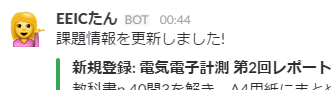

# EEIC2018 Bot

[EEIC](http://www.ee.t.u-tokyo.ac.jp/)2018のためのBotです。

以下、主にEEIC2018のためのREADME。

## 導入

nodeとredisをインストールしたあとこのリポジトリをcloneして、以下のコマンドを実行します。

    npm install -g npm-install-missing
    npm-install-missing
    npm start

## 課題お知らせちゃん (EEICたん)

膨大な量のEEICの課題をSlackにお知らせするBOT。

### やること

* 新しい課題が登録されるとお知らせします。
* 毎日17:00に次の日が締切の課題をお知らせします。
* 毎週土曜の10:00にその週の課題一覧をお知らせします。

### 課題登録

課題一覧はWikiの指定されたページを編集すると自動で登録されます。登録内容はサーバー上のRedisにキャッシュされています。登録情報が反映されるには1分ごとのcron実行まで待たないといけません。

Wikiページは誰でも気軽に編集してください。というか課題が出てるのに登録されてないのを見つけたらためらわずに編集してください。みんなのためです。
